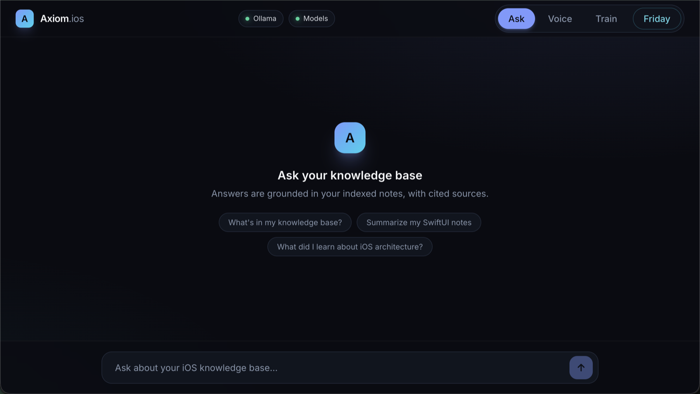
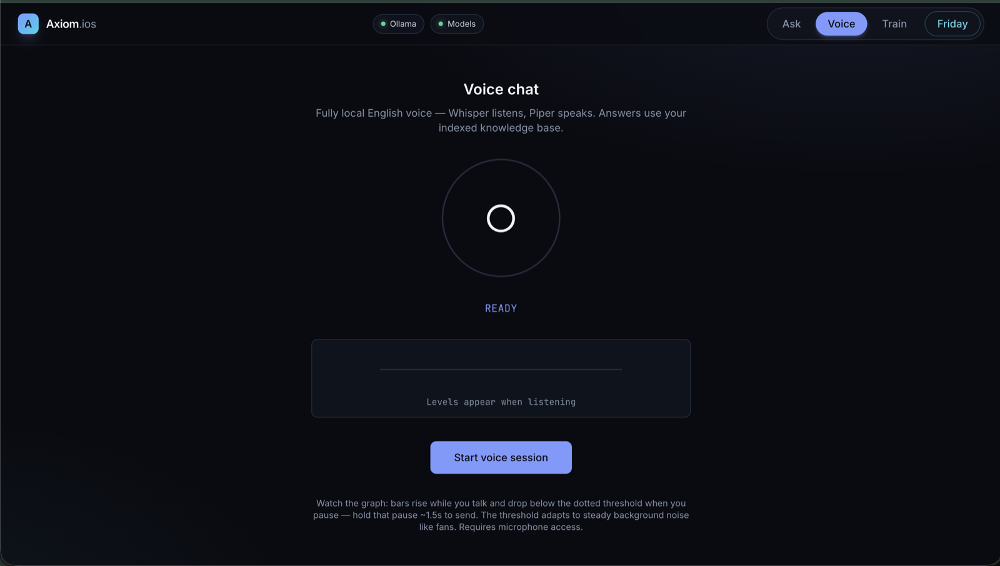
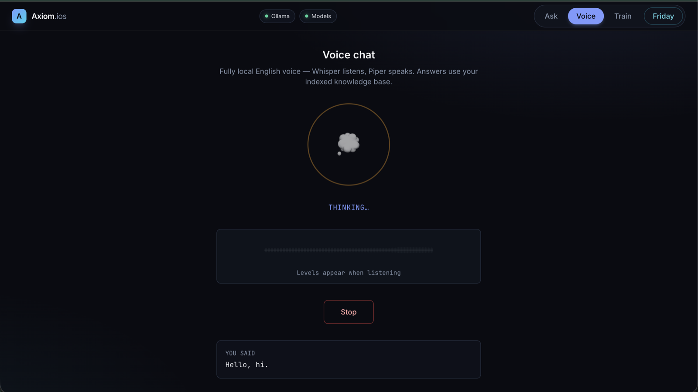
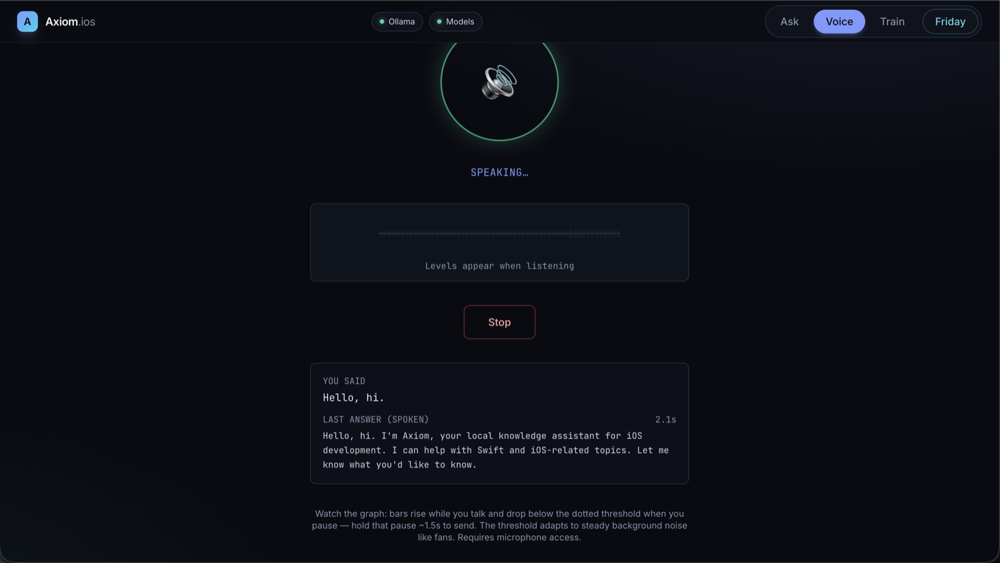
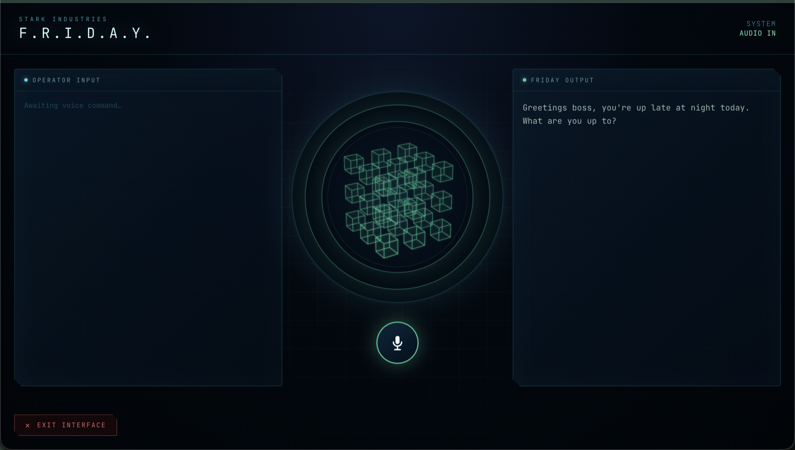

# Axiom.ios — Local RAG for iOS Development

A local-first retrieval-augmented generation (RAG) system optimized for **strong retrieval** and **lightweight reasoning**. Everything runs on your machine: Ollama for LLM + embeddings, ChromaDB for vectors, FastAPI for the API, and a React dashboard with Ask, Voice, Train, and Friday workflows.

## Demo

🎬 **[Watch the demo video](docs/demo.mp4)** (74s, 2.7 MB)

### Ask — query your knowledge base



### Voice — fully local speech loop (Whisper listens, Piper speaks)

| Ready | Thinking | Speaking |
|-------|----------|----------|
|  |  |  |

### Friday — J.A.R.V.I.S.-style voice assistant



## Architecture

```
┌─────────────┐     ┌──────────────┐     ┌─────────────────┐
│  React UI   │────▶│   FastAPI    │────▶│    ChromaDB     │
│  :3000      │     │   :8000      │     │  ./chroma_db    │
└─────────────┘     └──────┬───────┘     └────────▲────────┘
                           │                        │
                           ▼                        │
                    ┌──────────────┐                │
                    │    Ollama    │                │
                    │  :11434      │                │
                    ├──────────────┤                │
                    │ qwen3:4b-    │  answers         │
                    │  instruct    │                  │
                    │ nomic-embed  │  embeddings      │
                    └──────────────┘                │
                           ▲                        │
                           │                        │
                    ┌──────┴───────┐     indexer.py │
                    │  data/       │────────────────┘
                    │  notes/      │
                    │  repo_chunks/│
                    │  wwdc/       │
                    └──────────────┘
```

## Data Pathways

### Train (interactive)

1. User pastes content — or a page URL — in the **Train** tab
2. Text: `POST /api/train` writes `data/notes/note_<timestamp>.txt`.
   URL: `POST /api/train/url` scrapes the page's readable text (BeautifulSoup)
   and writes `data/notes/web_<title>_<timestamp>.txt` with a source header
3. `indexer.py` chunks text → Ollama `nomic-embed-text` → ChromaDB upsert
4. The tab lists all knowledge files with a content preview pane

### Ask (RAG query)

1. User submits a question in the **Ask** tab
2. `POST /api/ask/stream` embeds the question
3. ChromaDB returns top-5 similar chunks (sent to the UI immediately)
4. Context + question sent to `qwen3:4b-instruct` at `temperature: 0.0`
5. Answer tokens stream into the UI as they are generated, with sources
   (`POST /api/ask` is the non-streaming variant, used by Voice)

### Friday (voice assistant)

A full-screen J.A.R.V.I.S.-style voice mode: local Whisper transcribes,
the local LLM answers in persona, Piper speaks the reply. Asking for news
fetches headlines from public RSS feeds (BBC, CNBC, NYT, Al Jazeera) and
summarizes them locally.

### Batch index

`./embed.sh` walks all `data/*` directories and re-indexes supported files.

## Project Layout

```
axiom.ios/
├── .cursorrules          # Cursor AI coding rules
├── start.sh              # Start backend + frontend
├── embed.sh              # Full re-index
├── data/                 # Knowledge sources
├── chroma_db/            # Persistent vectors (gitignored)
├── backend/              # FastAPI + indexer
└── frontend/             # Vite + React + Tailwind
```

## Philosophy

- **Strong retrieval** — top-k semantic search grounds every answer
- **Lightweight reasoning** — small local model (`qwen3:4b-instruct`) synthesizes only from retrieved context
- **Deterministic** — `temperature: 0.0` reduces hallucination
- **Private** — no cloud AI APIs; inference, embeddings, and voice all run locally.
  The network is touched only when you ask for it: scraping a URL in Train, or
  Friday news briefings (public RSS). Your questions never leave the machine.

## Getting Started

See [SETUP.md](./SETUP.md) for prerequisites, commands, and troubleshooting.

```bash
./start.sh
```

Open http://localhost:3000 and start training your knowledge base.

### Voice chat (optional)

Local English voice loop (Whisper STT + Piper TTS + existing RAG):

```bash
./scripts/download_voice_models.sh
```

Then use the **Voice** tab. See [SETUP.md](./SETUP.md) for details.
